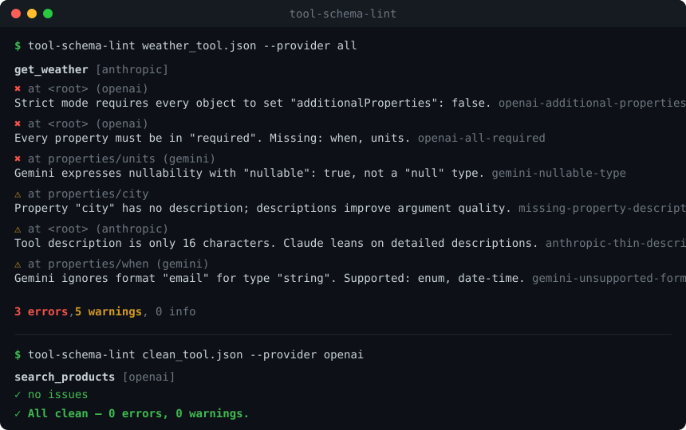

# tool-schema-lint

> Lint your LLM function-calling / tool-use JSON Schemas for **OpenAI**, **Anthropic**, and **Gemini** compatibility — *before* you ship an agent.



Every major LLM provider accepts a *different subset* of JSON Schema for tool / function definitions. A schema that works perfectly with Anthropic can be silently broken on OpenAI strict mode, or rejected outright by Gemini. The failures are quiet and frustrating: the model just stops calling your tool, or fills in garbage arguments.

`tool-schema-lint` reads a tool definition and tells you, per provider, exactly what will break and why — with the location in the schema and a fix. **Zero dependencies, no API key, runs offline.**

---

## Why

| Provider | A few of the rules checked |
|----------|----------------------------|
| **OpenAI** (strict) | object root required · every object needs `additionalProperties: false` · every property must be `required` · unsupported keywords (`oneOf`, `patternProperties`, `not`, …) · nesting-depth limit |
| **Anthropic** | `input_schema` must be an object · tool name must match `^[a-zA-Z0-9_-]{1,64}$` · thin tool descriptions |
| **Gemini** | no `$ref` · nullability via `nullable: true` (not `["string","null"]`) · only `anyOf` among combinators · unsupported `format` values · silently-ignored keywords |
| **All** | missing descriptions · missing/unknown `type` · `required` lists an undefined property · empty `enum` |

## Install

```bash
npm install -g tool-schema-lint
# or run it without installing:
npx tool-schema-lint tools.json
```

Requires Node.js 18+.

## Usage (CLI)

```bash
# Lint a file against every provider
tool-schema-lint tools.json --provider all

# Target a single provider
tool-schema-lint weather_tool.json --provider openai

# Pipe from stdin, get JSON back (great for CI)
cat tools.json | tool-schema-lint --provider gemini --json
```

The input can be a single tool definition, an array of them, or a `{ "tools": [...] }` envelope, in **OpenAI** (`{ type, function: { name, parameters } }`), **Anthropic** (`{ name, input_schema }`), or **raw JSON Schema** form — the format is auto-detected.

### Example

Given this (deliberately flawed) Anthropic tool:

```json
{
  "name": "get_weather",
  "description": "Get the weather.",
  "input_schema": {
    "type": "object",
    "properties": {
      "city": { "type": "string" },
      "when": { "type": "string", "format": "email" },
      "units": { "type": ["string", "null"] }
    },
    "required": ["city"]
  }
}
```

`tool-schema-lint get_weather.json --provider all` reports:

```
get_weather [anthropic]
  ✖ at <root> (openai)
    Strict mode requires every object to set "additionalProperties": false.
  ✖ at <root> (openai)
    Every property must be in "required". Missing: when, units.
  ✖ at properties/units (gemini)
    Gemini expresses nullability with "nullable": true, not a "null" type or type array.
  ⚠ at properties/when (gemini)
    Gemini ignores format "email" for type "string". Supported: enum, date-time.
  ...
3 errors, 5 warnings, 0 info
```

Exit code is `1` when there are errors, `0` when clean — drop it straight into CI.

## Usage (library)

```js
import { lint, formatText } from 'tool-schema-lint';

const report = lint(myToolDefinition, { provider: 'openai' });

console.log(report.ok);             // false
console.log(report.summary);        // { errors: 1, warnings: 2, info: 0 }
console.log(formatText(report));    // pretty, colored output

for (const tool of report.tools) {
  for (const f of tool.findings) {
    console.log(f.severity, f.rule, f.path, f.message);
  }
}
```

### Options

| Option | Default | Meaning |
|--------|---------|---------|
| `provider` | `'all'` | `'openai'` \| `'anthropic'` \| `'gemini'` \| `'all'` \| array |
| `strict` | `true` | enforce OpenAI strict-mode rules (`additionalProperties`, all-required) |
| `maxDepth` | `5` | warn when object nesting goes deeper than this |

## How it works

1. **Extract** — normalize whatever tool format you pass into `{ name, description, schema }`.
2. **Walk** — recurse the JSON Schema, tracking the path and nesting depth of every subschema.
3. **Rules** — run provider-agnostic rules plus the rules for each selected provider; each emits findings with a severity, a rule id, a schema path, and a message.
4. **Report** — aggregate into a summary and render as text or JSON.

Every rule is a small pure function, so adding or tweaking one is trivial.

## Development

```bash
npm test     # node --test, zero dependencies
```

## License

MIT © 2026 Ayubjon

## Support

If this project is useful to you, you can support its development with a crypto tip — thank you!

**USDT — Ethereum (ERC-20):**

`0xad39bdf2df0b8dd6991150fcea0a156150ed19b8`

[View / verify on Etherscan](https://etherscan.io/address/0xad39bdf2df0b8dd6991150fcea0a156150ed19b8)

> Send only on the **Ethereum (ERC-20)** network.
